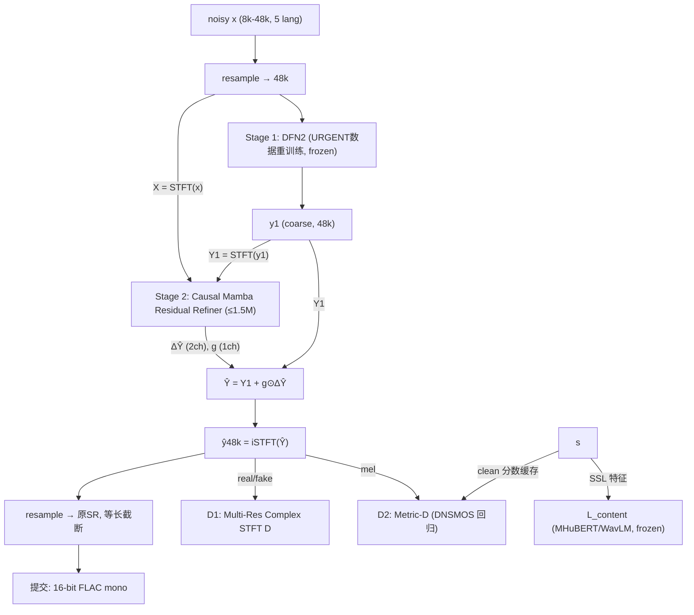

# DF-GR 具体实现方案（URGENT 2025 版）

> 工作名：**DF-GR** (DeepFilterNet-based Generative Residual Refinement)
> 上游思路：[[两阶段思路]]　|　背景调研：[[论文整理]]、[[SenSE-阅读笔记]]
> 一句话：**在 URGENT 2025 协议下（7 种失真 × 5 语言 × 7 采样率），用重训练的轻量判别式 backbone 守住 4 类指标中的保真类，用一个 ≤1.5M 参数的因果生成器只预测并门控 Stage-1 的复谱残差，专门改善无参考感知类指标——不牺牲任何一类。**

**v2 变更摘要**（相对 DNS/VB+DEMAND 版）：
1. 任务从"去噪+混响"扩展为 URGENT 全部 **7 种失真**（含带宽扩展、packet loss——原方案排除的任务现在是核心卖点）；
2. Stage-1 **不能用 DFN2 官方预训练权重**（规则禁止非官方数据预训练的 SE 模型）→ 必须在 URGENT 数据上重训练；
3. 多采样率 I/O 管线：内部 48k 处理，输出重采样回输入原采样率；
4. 评估全部对齐官方 4 类指标 + 官方排名机制（类别平均排名）；
5. 训练数据/动态混合直接复用官方 `urgent2025_challenge` 脚本；
6. 新增按失真类型/语言/采样率的切片分析（官方 metadata 公开）。

---

## 0. 赛事定位与版本策略

**URGENT Challenge 要点**（Interspeech 2025 版，官网 urgent-challenge.github.io/urgent2025）：

| 维度 | 内容 |
|---|---|
| 失真（7 种） | 加性噪声、混响、削波、带宽限制、编解码伪影、packet loss、风噪 |
| 语言（5 种） | 英、德、法、西、中（zh-CN） |
| 输入采样率（7 档） | 8k / 16k / 22.05k / 24k / 32k / 44.1k / 48k |
| 赛道 | **Track 1（主赛道）**：~2.5k h 语音 + ~0.5k h 噪声；Track 2：~60k h（数据规模赛道） |
| 关键规则 | 只准用官方列出数据；**禁用非官方数据预训练的 SE 模型**（官方 baseline 可用）；基础模型（HuBERT/WavLM/EnCodec 等）可用但需声明；禁测试集自适应；**无延迟/因果性约束** |
| 官方 baseline | TF-GridNet（ESPnet，`kohei0209/espnet` urgent2025 分支，HF: `kohei0209/tfgridnet_urgent25`） |
| 数据 | DNS5/LibriTTS/VCTK/WSJ(LDC)/EARS/CommonVoice19.0/MLS 语音 + DNS5/WHAM!/FSD50K/FMA 噪声 + DNS5 RIR；磁盘 ≥1.3 TB |

**版本策略（重要）**：URGENT 2025 已于 2025 年 1 月结束，但其官方 validation / non-blind test 的**干净参考与 metadata 均已公开**，blind test 的 noisy 也公开。因此：
- **开发与论文**：完全基于 URGENT 2025 数据 + 官方评测脚本（可离线复现全部 4 类指标与排名模拟），随时可产出论文级结果；
- **参赛**：盯官网下一届公告（URGENT 2026 已增设 Track 2 = 语音质量评估，Track 1 延续 SE；核心协议高度稳定，本方案可直接迁移，届时只需核对数据清单/失真参数差异并报名）；
- 论文双轨：下一届 challenge paper（官方 special session）+ 方法论文（普通投稿，用 URGENT 2025 协议做 benchmark）。

**为什么 DF-GR 天然适配 URGENT 的排名机制**：官方总排名 = 4 类指标各自取 metric 平均 → dense rank → **类内平均 → 类间平均**。纯判别式系统在 intrusive（SDR/PESQ/MCD/LSD）和 downstream（CER/SpkSim）强但 non-intrusive（DNSMOS/NISQA/UTMOS）弱；纯生成式正相反（官方动机页明说生成式"generalize better"但能力未被充分理解）。**残差 + 门控精修恰好是"在保真类不退分的前提下抬感知类"的结构化方案**——一个模型在 4 类都不瘸腿，正是类别平均排名机制下的最优策略。

---

## 1. 论文定位与研究主张

**研究问题**：通用语音增强（USE）中，生成式方法提升无参考感知质量，但常以保真度（SDR、CER、SpkSim）为代价；在 URGENT 的 7 失真 × 5 语言 × 7 采样率协议与类别平均排名下，这种 trade-off 能否被结构性缓解？

**三个可检验假设**：

- **H1（归纳偏置）**：把生成器输出限制在 Stage-1 残差子空间（ΔY = Y − Y₁）+ zero-init + 门控，可在 intrusive/downstream 类指标不退的前提下取得 non-intrusive 类的大部增益。
- **H2（失真感知门控）**：门控 g 能无监督学出失真类型/严重度的分化行为——可逆失真（噪声/混响）下 g 低（Stage-1 可信），信息缺失失真（削波/带宽/packet loss/编解码）下 g 高（允许生成式补全）。**URGENT metadata 提供 per-sample 失真参数，可直接检验。**
- **H3（可调权衡）**：推理期缩放门控（g→g^τ）给出一条覆盖 4 类指标的可调曲线，一个模型多个工作点，整体优于直接生成式 GAN 的对应曲线。

**与最近邻工作的差异（related work 骨架）**：

| 工作                                                   | 关系           | 我们的差异                                    |
| ---------------------------------------------------- | ------------ | ---------------------------------------- |
| USEMamba（arXiv:2505.21198，URGENT25 Track 1 盲测第 2）    | 思想最近：回归+生成互补 | 我们：一步式对抗残差（无采样步）、显式门控安全机制、效率指标、按失真类型分解分析 |
| Rethinking…（arXiv:2603.02641）                        | 回归冻结+生成式残差修正 | 同上；且其生成分支为扩散式采样                          |
| SEGAN / CMGAN / MetricGAN+                           | 端到端生成        | 残差子空间约束 + 保真保险丝                          |
| 两阶段 CycleGAN complex network（Applied Acoustics 2021） | 粗+精两阶段       | Stage-2 为确定性复谱映射；我们为对抗式 + 门控             |
| 多阶段 560k（arXiv:2312.12415）                           | 轻量两阶段可行依据    | 同上                                       |
| FRSE（flow-matching 残差解耦）                             | 生成式残差分解      | 单步对抗、可流式                                 |
| SenSE（语义先验 + flow matching）                          | 生成式 USE 另一极端 | 轻量、保真优先、无语义 LM 依赖                        |
| RE-USE（One Model, Many Latencies, arXiv:2606.25621）  | 多延迟部署        | 我们的 τ 门控是"多质量工作点"，与多延迟正交可叠加              |

---

## 2. 任务定义与符号

$$x:\text{noisy（任意SR，重采样至48k）},\quad s:\text{clean target（48k 全带）},\quad y_1 = D(x)\ (\text{Stage-1，URGENT数据重训练后冻结})$$
$$X=\mathrm{STFT}(x),\quad Y=\mathrm{STFT}(s),\quad Y_1=\mathrm{STFT}(y_1),\quad \Delta Y = Y - Y_1$$

Stage-2 生成器输出残差与门控：
$$G(X, Y_1) \rightarrow (\Delta\hat Y,\ g),\qquad g=\sigma(\cdot)\in(0,1)^{F\times T}$$

合成与输出：
$$\hat Y = Y_1 + g \odot \Delta\hat Y,\qquad \hat y_{48k}=\mathrm{iSTFT}(\hat Y),\qquad \hat y=\mathrm{resample}(\hat y_{48k},\ \mathrm{SR}_{in})$$

输出必须**重采样回输入文件原始采样率**、mono、16-bit FLAC、与原文件同名等长（提交规则）。

**三个安全设计（"do no harm"，对应 H1）**：
1. Δ 头 **zero-init**：初始 ŷ≡y₁，从"不改变"出发；
2. gate 头 **bias=−2**（σ≈0.12）：默认信任 Stage-1；
3. gate 稀疏正则 L_gate。

**多采样率处理**：
- 输入统一升采样到 48k（官方数据准备脚本已提供重采样版本），STFT/DFN2/Stage-2 全部在 48k 域；
- 带宽失真 = 文件采样率内的频带缺失，Stage-2 在 48k 域看到缺失频带并补全，输出时重采样回原 SR（例如 16k 文件中 4k 有效带宽 → 恢复至 8k Nyquist 带宽）；
- 重采样用 torchaudio（anti-alias），输出**裁剪/补零至原始采样数**保证等长；
- （可选消融）Stage-2 输入加有效带宽估计 c(x) 作为条件，帮助门控分化——输入 log 谱本身已隐含此信息，验证显式条件是否多余。

---

## 3. 系统总体结构



**预算表**：

| 项目 | 目标 |
|---|---|
| Stage-2 参数量 | ≤ 1.5M |
| Stage-2 CPU RTF（48k 单线程） | ≤ 0.04（总 RTF ≤ 0.08，非官方要求，是论文效率卖点） |
| Non-intrusive 类 | DNSMOS/NISQA/UTMOS 相对 Stage-1 全部 ≥ 持平且至少一项 +0.1 |
| Intrusive 类 | SDR/ESTOI 不降，PESQ/MCD/LSD 不降超过噪声容差 |
| Downstream 类 | CER、SpkSim、LPS、SpeechBERTScore 相对 Stage-1 变化 ≤ 0（理想为改善） |

---

## 4. Stage-1：DFN2 在 URGENT 数据上重训练

**规则硬约束**：DFN2 官方 checkpoint 训练于非 URGENT 数据（DNS 类），**禁止使用**。允许的初始化只有 URGENT 2024/2025 官方 baseline（TF-GridNet）。

**F1 默认配置**：DFN2 架构从头训练
- 训练数据：官方 Track 1 全量 + 官方 `simulation/` 动态混合（7 失真、多语言、多 SR，直接用官方 `conf/simulation_train.yaml` 配方）；
- 损失：官方 DFN2 损失（SI-SDR + multi-res STFT）+ 轻量 content loss（λ 小，保证 Stage-1 本身内容不漂）；
- CommonVoice 含噪问题（官方故意为之）：Stage-1 训练时对 CommonVoice 子集做 DNSMOS 过滤（阈值 ~3.2）或降采样率使用——这也是官方鼓励研究的数据质量课题，可作论文附带贡献；
- 训练量级：~2.5k h 动态混合、~2 天/张 4090；causal 与 non-causal 各训一版（比赛无延迟约束 → 提交用分高者；效率主张用 causal 版）。

**F2 对照配置（消融 J）**：官方 TF-GridNet baseline（允许直接用，且为榜单公共参照系）作 Stage-1，验证残差精修器对 backbone 的通用性。

**F3（可选）**：Stage-2 定型后解冻 Stage-1 联合微调 20k steps（lr 1e-5 + content loss），风险高，仅作记录。

**STFT 配置**：跟随 DFN2 默认（48 kHz、20 ms sqrt-Hann、10 ms hop、n_fft=960、F=481），Stage-2 用同一套分析/合成参数。

---

## 5. Stage-2 生成器设计

### 5.1 输入表示（6 通道，B,T,F,6）

```text
ch0-1: Re(X), Im(X)              # 带噪复谱（被 Stage-1 滤掉的信息 + 缺失带信息）
ch2-3: Re(Y1), Im(Y1)            # Stage-1 复谱
ch4-5: log(|X|+ε), log(|Y1|+ε)   # 幅度域显式线索（带宽/削波/风噪在幅度域最直观）
```

归一化：复数通道除以 utterance 级 RMS；log 幅度 per-utterance 标准化（流式推理用指数滑动统计）。多语言无需显式条件（WavLM/MHuBERT content loss 本身语言无关）。

### 5.2 架构 B（旗舰）：因果 Mamba Residual Refiner

```text
Input (B,T,F,6) → reshape (B,T,F*6) → LayerNorm
   ▼
Linear → d=128
   ▼
┌─× 4 blocks ─────────────────────────┐
│ CausalDWConv1d(k=5)                  │
│ → CausalMamba(d=128, d_state=16,     │
│             expand=2)                │
│ → GLU(Linear→2d) → 残差 + LayerNorm  │
└──────────────────────────────────────┘
   ▼
Linear(d → 3F) → (B,T,F,3)
   ch0-1: ΔR, ΔI      —— zero-init
   ch2:   gate logit  —— bias init = −2
```

参数量 ≈ 1.1M。Mamba 的固定 recurrent state 天然适配多 SR（帧数随 SR 变化但状态维度不变）。备选压缩：trunk 在 ERB 32 带域运行，输出头展开回 481 频点（省 ~0.3M）。

### 5.3 架构 A（对照/fallback）：因果 2D-UNet

5 层 2D 卷积（时间因果、频率对称）32→64→128→64→32 + skip，输出 3 通道。用于骨干消融与 ONNX 兜底。

### 5.4 流式推理

CausalDWConv 缓存 k−1 帧；Mamba 固定状态；归一化流式统计。导出 ONNX 验证（Mamba 算子不支持时手写 selective-scan 或退架构 A）。**注意：官方无实时要求，流式是论文的效率副产物，不是提交前提。**

---

## 6. 判别器设计

### D1：Multi-Resolution Complex STFT Discriminator（MRD）

- 3 分辨率 (512,128)/(1024,256)/(2048,512) @48k，输入**复谱 2 通道**（看得见相位——修的就是复残差）；
- 每个 4–5 层 conv2d（spectral norm）→ utterance 均值 logit；hinge 损失；FM 取中间层 L1。

### D2：Metric Discriminator（借 CMGAN/MetricGAN+）

- 输入 80 维 mel；4 层 conv2d → GRU(128) → attention pooling → 标量 ŝ；
- 回归目标：clean 样本的 DNSMOS OVRL（离线 onnxruntime 缓存，每条一次）；可加第二头拟合 NISQA（48k，与 DNSMOS 分辨率不同需两个输入分支，或仅用 DNSMOS）；
- G 侧动态 target：$\mathcal{L}_{metric}=\mathrm{MSE}(D_2(\hat y),\min(D_2(\hat y)_{detach}+0.1,\ 4.5))$。

> **⚠️ 规则灰区（开工前邮件/Slack 向 organizers 确认）**：DNSMOS/UTMOS/NISQA 是质量预测模型而非 SE 模型，按规则第 1 条"pretrained foundation models（HuBERT/WavLM/EnCodec/Llama 等）可用"的精神应属允许，且它们本身是官方评测指标；但为稳妥：(a) 提交前确认；(b) 备选方案 = MRD + SSL 特征匹配（只用允许的 WavLM/MHuBERT），损失设计上保证去掉 D2 也能跑通。URGENT-PK（官方排序模型，arXiv:2506.23874）训练于 URGENT2024 数据，用于 2025 训练同样需确认。

---

## 7. 损失函数

$$\mathcal{L}_G = \lambda_{res}\mathcal{L}_{res} + \lambda_{mr}\mathcal{L}_{MRSTFT} + \lambda_{fm}\mathcal{L}_{FM} + \lambda_{c}\mathcal{L}_{content} + \lambda_{g}\mathcal{L}_{gate} + \lambda_{adv}\mathcal{L}_{adv} + \lambda_{m}\mathcal{L}_{metric}$$

| Loss | 定义 | 初始权重 | 调参方向 |
|---|---|---|---|
| $\mathcal{L}_{res}$ | $\|\Delta\hat Y-\Delta Y\|_1$（复域） | 100 | 过强压抑生成细节 → 降 45 |
| $\mathcal{L}_{MRSTFT}$ | 多分辨率 STFT（$\hat y$ vs $s$，48k 域） | 45 | — |
| $\mathcal{L}_{FM}$ | MRD 中间层 L1 | 10 | GAN 稳定器 |
| $\mathcal{L}_{content}$ | $\|f_{SSL}(\hat y)-f_{SSL}(s)\|_1$，SSL=**MHuBERT-147（对齐官方 SpeechBERTScore 后端）** 或 WavLM，冻结 | 30 | CER/SpeechBERTScore 恶化时阶梯上调 60→150 |
| $\mathcal{L}_{gate}$ | mean(g) | 0.5 | gate 塌缩时降/去 |
| $\mathcal{L}_{adv}$ | hinge（MRD） | 0→1 ramp | 前 20k steps 线性 0→1 |
| $\mathcal{L}_{metric}$ | 见 §6 | 1 | 与 L_adv 同步 ramp |

**可选 $\mathcal{L}_{spk}$**：WavLM-large speaker embedding 余弦（λ=5），SpkSim 掉分时启用。

**监控信号（每 5k steps，官方 val 上）**：
- DNSMOS↑ 且 CER/SDR 持平 → 健康；
- DNSMOS↑ 但 CER↑（注意中文分桶）→ 提 λ_content / 降 λ_adv / 推理 τ>1；
- ŷ≈y₁ → 降 λ_gate；
- D 饱和 → D lr 减半 / R1 正则。

---

## 8. 训练流程

### Phase A：纯重建热身（~100k steps）
$\mathcal{L}_{res}+\mathcal{L}_{MRSTFT}+\mathcal{L}_{content}$，无 D。**验收 gate：官方 val 上 PESQ(ŷ)≥PESQ(y₁) 且 DNSMOS 不降。**

### Phase B：对抗 + metric（100k–300k steps）
加入 MRD/FM/D2，λ ramp 0→1，G/D 1:1，G 用 EMA(0.999) 评估。

### 数据与混合（全部走官方脚本）
- 数据准备：`urgent2025_challenge` 仓库（Python 3.10 环境、FFmpeg 路径配置、eSpeak-NG 安装、`prepare_espnet_data.sh`；CommonVoice 19.0 五语言需手动取下载链接；WSJ 无 LDC license 时可先跳过并邮件 organizers 申请临时 license——允许只用官方数据子集开发）；
- 动态混合：直接复用官方 `simulation/`（on-the-fly，7 失真 + 多 SR + 风噪/编解码 FFmpeg 模拟），我们的 dataloader 读同一套 scp/格式（可复用 ESPnet dataset 类或抽 `simulation/` 模块进自有代码）；
- 去混响目标：**按官方 simulation 配方**（early-reflection 目标；Rethinking 论文的时间偏移问题记入消融讨论，不擅自改目标以免与官方指标不可比）；
- CommonVoice 过滤：DNSMOS≥3.2 保留为干净目标，其余只作带噪输入侧增强素材（或直接剔除）；
- SNR/失真参数：默认 `conf/simulation_train.yaml`，不做激进改动（榜单可比性优先）；
- 每 batch 随机 SR（模拟输入 7 档 → 内部 48k）；
- 失真切片课程：前 50k steps 提高噪声/混响占比 → 之后均匀 7 失真，确保信息缺失类失真有足够样本让门控分化（验证 H2 需要每类 ≥ 一定样本量）。

### 优化器

| 项         | G                                                                        | D   |
| --------- | ------------------------------------------------------------------------ | --- |
| AdamW     | lr 2e-4, β=(0.8,0.99), decay 0.999                                       | 同   |
| batch     | 8 × 4 s @48k（24G 卡）                                                      | 同步  |
| grad clip | 1.0                                                                      | 1.0 |
| 增强        | y₁ 加 micro-noise(σ=1e-3)/EQ 抖动，防过拟合 Stage-1 伪影；混用 2 个 Stage-1 checkpoint | —   |

---

## 9. 评估协议（全部对齐官方）

### 指标：直接运行官方 `evaluation_metrics/` 脚本

| 类别                | 指标（脚本）                                                                                         | 采样率             |
| ----------------- | ---------------------------------------------------------------------------------------------- | --------------- |
| Non-intrusive     | DNSMOS↑ / NISQA↑ / UTMOS↑                                                                      | 16k / 48k / 16k |
| Intrusive         | PESQ↑{8,16k} / ESTOI↑(10k) / SDR↑ / MCD↓ / LSD↓（`calculate_intrusive_se_metrics.py`）；POLQA 仅盲测 | —               |
| Downstream-indep. | SpeechBERTScore↑（**MHuBERT-147 后端**）/ LPS↑（eSpeak-NG + wav2vec2 音素）                            | 16k             |
| Downstream-dep.   | SpkSim↑ / Character Accuracy = 1−CER↑                                                          | 16k             |

### 测试基准
1. **官方 validation set**（noisy+clean+metadata 公开）——开发期主基准；
2. **官方 non-blind test set**（noisy+clean+metadata 公开）——论文主表；
3. **官方 blind test set**（noisy 公开）——non-intrusive 类 + 与榜单已公布结果横向对照（若仍有参考 unpublished 则只报无参考指标）；
4. 自建切片：按 metadata 的失真类型（7 类）× 语言（5）× SR（7）分解。

### 排名模拟
按官方规则本地复现 4 类排名：per-metric dense rank → 类内平均 → 类间平均，对照系统 = {noisy input, 官方 TF-GridNet baseline, Stage-1-only, DF-GR 各消融}。**论文核心表 = 这个排名表。**

### 提交格式（参赛时）
zip ≤ 300MB：`README.yaml`（团队信息+数据/预训练模型声明——**WavLM/MHuBERT/DNSMOS-D 等必须写明**）+ `enhanced/*.flac`（16-bit mono、原采样率、同名等长）；每天 2 次提交配额，最终取最佳。

---

## 10. 消融实验矩阵

| ID | 配置 | 回答的问题 |
|---|---|---|
| A | Stage-1 only（DFN2 重训练） | baseline |
| B | + 残差 G（纯重建） | 残差精修本身 |
| C | B + MRD 对抗 + FM | 对抗增益 |
| D | C + content loss | 保真保险丝 |
| E | D + gate + zero-init | 门控安全机制（**默认最终模型**） |
| F | E + metric-D | metric 感知增益 |
| **G** | **E 但直接预测 Ŷ（普通 conditional GAN）** | **残差归纳偏置——核心对照** |
| H | E 去掉 gate（固定 α=1） | gate 必要性 |
| I | 非因果 Stage-2（双向 Mamba） | 因果化代价 |
| J | Stage-1 = 官方 TF-GridNet | 精修器通用性 + 榜单可比性 |
| K | 架构 B vs A | 骨干选择 |
| L | content SSL：MHuBERT-147 vs WavLM vs 无 | 与官方指标对齐的价值 |

全部消融先在官方 validation 上跑通，主结论在 non-blind test 复验 E/F/G/H/J。

---

## 11. 分析实验（科研价值主体，URGENT 增强版）

1. **门控 × 失真类型（H2 核心图）**：用官方 metadata 的 per-sample 失真参数，统计 g 的分布按 7 类失真分解——预期：噪声/混响下 g 低，削波/带宽/packet loss/编解码下 g 高；同时算 g 与 |ΔY|（oracle 残差能量）、局部 SNR 的 Pearson 相关。**这是 URGENT 协议独有的分析**（metadata 公开），也是论文最出彩的图。
2. **4 类指标 Pareto / 排名模拟**：推理期扫 g→g^τ（τ∈{0.25,0.5,1,2,4}），画 (DNSMOS, SDR, CER, SpkSim) 随 τ 的曲线族 + 类别平均排名随 τ 的变化；对照 G（直接生成）。E 的曲线应整体占优 → H1+H3。
3. **残差分解**：用 clean/noise oracle IBM 把 T-F 平面分语音/噪声区，统计 g⊙ΔŶ 能量分配（补语音细节 vs 压残留噪声 vs 带宽补全区），并算语音区相位误差余弦改善。
4. **多语言幻觉分析（官方明示关切）**：Whisper 转写 token insertion 率按语言分桶（zh 单独看），对比 y₁ / ŷ(DF-GR) / ŷ(消融 G)。生成式 SE 的语言依赖是 URGENT 的立赛动机之一，直接回应。
5. **采样率切片**：增益 vs 输入 SR（8k 最难——带宽缺失最重，看门控是否自动放大）。
6. **（可选）小规模 MOS 听测**（≥10 人），防 DNSMOS 过拟合质疑；可用 URGENT-PK 作系统级排序参考。

---

## 12. 工程实现

### 代码结构
```text
dfgr/
├── third_party/
│   ├── DeepFilterNet/            # fork，从头训练 Stage-1
│   ├── urgent2025_challenge/     # 官方数据准备 + 评测脚本（submodule）
│   └── espnet-urgent2025/        # TF-GridNet baseline（消融 J + 排名参照）
├── dfgr/
│   ├── models/                   # generator.py / discriminator.py / losses.py
│   ├── data/
│   │   ├── urgent_dynamic_mix.py # 包装官方 simulation/，7失真+多SR
│   │   └── dnsmos_cache.py       # clean 分数缓存
│   ├── train/                    # phase_a.py / phase_b.py / stream_cache.py
│   └── eval/
│       ├── run_official_metrics.sh  # 串联官方 evaluation_metrics/ 全套
│       ├── rank_simulation.py       # 4类排名复现
│       ├── resample_io.py           # 48k→原SR 等长输出 + FLAC 打包
│       └── analysis/             # gate×失真 / Pareto / 残差分解 / 语言切片
└── scripts/
```

### 依赖
`torch, torchaudio, mamba-ssm, causal-conv1d, espnet(urgent2025分支), onnxruntime, transformers(MHuBERT/WavLM/Whisper), soundfile, flac, eSpeak-NG, ffmpeg`；环境按官方 `environment.yaml` 建 `urgent2025` 环境跑数据/评测，另建训练环境。

### 磁盘与数据预算
- ≥1.3 TB（Track 1：DNS5 225G + LibriTTS 51G + VCTK 12G + EARS 61G + CommonVoice 421G + MLS 120G + 噪声 259G + RIR 6G 等）；解压后可删压缩包；
- 无 WSJ 也能开发（官方允许只用子集），同步邮件申请临时 license。

### 12 周里程碑

| 周 | 内容 | 验收 gate |
|---|---|---|
| W1 | 数据准备全量跑通（官方脚本）+ 磁盘规划 + WSJ 申请 | scp 文件生成、抽听正常 |
| W2 | DFN2 在 URGENT 动态混合上重训练（causal + non-causal） | Stage-1 指标 ≥ 官方 baseline 的 95%（官方 val，4 类平均排名不垫底） |
| W3 | 官方评测全链路打通（含 rank 模拟）+ baseline 指标表落盘 | noisy/baseline/Stage-1 三行排名表 |
| W4 | Stage-2 Phase A + gate×失真分析 v0 | **PESQ(B)≥PESQ(A)**，否则停下 debug |
| W5–6 | Phase B 对抗训练 + 稳定性调参 | DNSMOS(C/E) ≥ A + 0.1 |
| W7 | 全指标 + λ 调整 + CER 切片 | CER/SDR/SpkSim 不退 |
| W8 | 消融 B/C/D/E/H + L（validation 集） | 表格完整 |
| W9 | 核心对照 G + J + Pareto 扫描 + 分析 1–5 | E 曲线优于 G |
| W10 | 最优配置重训（2–3 seeds）+ non-blind test 终评 | 结果可复现 |
| W11 | 效率基准（CPU RTF/ONNX）+ 提交包演练（FLAC/README.yaml/排名） | 提交包通过本地校验 |
| W12 | 写作：challenge paper（若有新一届）+ 方法论文初稿 | 初稿 |

### 算力预算
单张 RTX 4090（24G）可完成全流程（Stage-1 ~2 天 + Stage-2 每 run 1–2 天 + 消融并行）；两张卡可将 W8–W10 压缩一半。Track 2（60k h）不建议现在碰。

---

## 13. 风险与应对

| 风险 | 信号 | 应对 |
|---|---|---|
| **规则合规**：DNSMOS-D / URGENT-PK 属灰区 | organizers 回复禁止 | 邮件确认（W1 发出）；备选：MRD + WavLM/MHuBERT 特征匹配版（D2 可整体移除） |
| **规则合规**：DFN2 官方权重禁用 | — | 已改为 URGENT 数据重训练（F1） |
| DFN2 重训练后弱于官方 baseline 太多 | W2 gate 不过 | 加 content loss / 初始化借 TF-GridNet（允许）→ 或 Stage-1 直接用官方 baseline（F2 转正），效率故事降级为次要贡献 |
| GAN 不稳定 | hinge 饱和、DNSMOS 震荡 | Phase A 初始化 + ramp + FM + EMA；仍不行去掉 D2 |
| Gate 塌缩 | ‖ΔŶ‖→0 | 降 λ_gate / warmup 期 g≡1 / bias 归零 |
| 内容漂移（尤其中文） | CER(zh)↑、insertion↑ | λ_content 阶梯上调；τ>1；检查 MHuBERT vs WavLM（消融 L） |
| 带宽/packet loss 补全变成幻觉重灾区 | 该失真切片 CER 恶化 | 对该切片单独加权 content loss；gate 上限 clip（g≤0.8）消融 |
| 过拟合 Stage-1 伪影 | 换 Stage-1 checkpoint 崩 | micro-noise/EQ 抖动；混用 2 checkpoints |
| 排名机制反噬（只顾 DNSMOS） | 类别平均排名不升 | 监控 4 类排名表而非单指标；τ 调回 |
| 多 SR 重采样误差 | SDR 轻微系统性下降 | 检查 resample 抗混叠；评测链路与官方脚本完全一致 |
| CommonVoice 噪声目标污染残差 | Phase A 指标异常 | DNSMOS≥3.2 过滤（已列 §8） |
| 磁盘/时间超预算 | 数据准备 >1 周 | 先用 DNS5+LibriTTS+VCTK 子集起跑，CommonVoice/MLS 后补 |

---

## 14. 论文框架

**候选标题**：
- *DF-GR: Gated Adversarial Residual Refinement for Universal Speech Enhancement*
- *Refine, Don't Regenerate: Category-Balanced Universal Speech Enhancement via Gated Residual Refinement*

**贡献点（3 条）**：
1. 门控对抗残差精修：生成容量被约束在判别式 Stage-1 误差子空间，zero-init + gate 提供 do-no-harm 保证，一步式（无采样）适配 7 失真 × 5 语言 × 7 采样率；
2. URGENT 协议下系统实证：4 类指标（12+ metrics）与官方类别平均排名下的均衡提升 + fidelity–perception Pareto（τ 扫描）；
3. 可解释性：门控行为按失真类型分解（可逆 vs 信息缺失失真的分化）、残差能量分解、多语言幻觉分析。

**投稿目标**：下一届 URGENT challenge paper（官方 special session）+ 方法论文（Interspeech/ICASSP 常规投稿，URGENT 2025 协议作 benchmark——评测全公开可复现，不依赖赛事窗口）。

**图表清单**：Fig.1 架构图；Fig.2 gate×7 失真分布（核心图）；Fig.3 4 类指标 Pareto/排名随 τ；Fig.4 残差分解/频谱案例（带宽补全 + packet loss inpaint 各一例）；Tab.1 non-blind test 主表（全指标 + 4 类排名）；Tab.2 消融；Tab.3 按语言/SR 切片；Tab.4 效率（params/RTF）。

---

## 15. 开工前需确认的 3 个决定

1. **Stage-1 路线**：DFN2 重训练（F1，效率故事完整）还是官方 TF-GridNet（F2，榜单最稳、起步最快）？→ 建议：W2–W3 两条都跑（F2 只是推理+生成 y₁ 缓存，成本低），W3 末按排名数据定主力，另一个自动成为消融 J。
2. **目标窗口**：盯下一届 URGENT（官网公告后报名，规则差异核对需 1–2 天）还是纯论文导向（URGENT 2025 公开评测做 benchmark，不受赛事时间约束）？→ 两者前 10 周工作完全相同，W10 前再定。
3. **数据与资源**：1.3 TB 磁盘是否就绪？CommonVoice 19.0 下载链接（需手动获取五语言）、WSJ license 申请、eSpeak-NG/FFmpeg 环境这三件事 W1 就要启动（均有等待期）。
